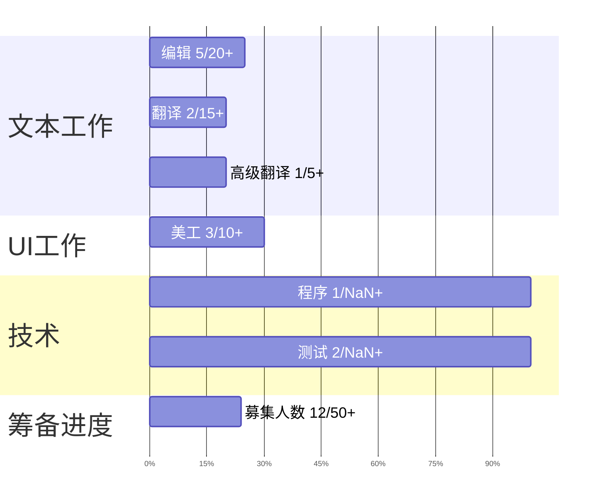

# 汉化进度

偶像大师OFA汉化人员筹备进度如下(已募集人数 / 预计需求人数)：

```mermaid!
%%{init:{
  "gantt" :{
    "barGap":40,
    "barHeight": 40,
    "fontSize":20,
    "sectionFontSize":35,
    "leftPadding":200
  }
}}%%
gantt
    title 　
    dateFormat  X
    axisFormat %s%%

    section 文本工作
    编辑 5/20+: editor,0,25
    翻译 2/15+ : tl,0,20
    高级翻译 1/5+ : sentl,0,20
    section UI工作
    美工 3/10+ : re,0,30
    section 技术
    程序 1/NaN+ : pg,0,100
    测试 2/NaN+ : test,0,100
    section 筹备进度
    募集人数 12/50+ : total,0,24
```







## 效果预览



